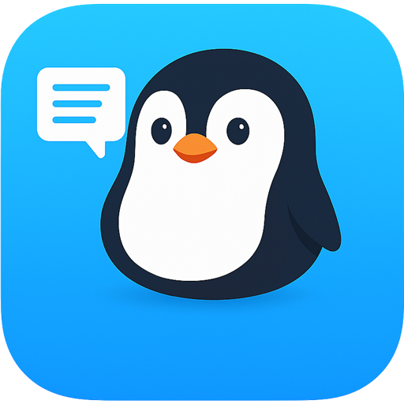
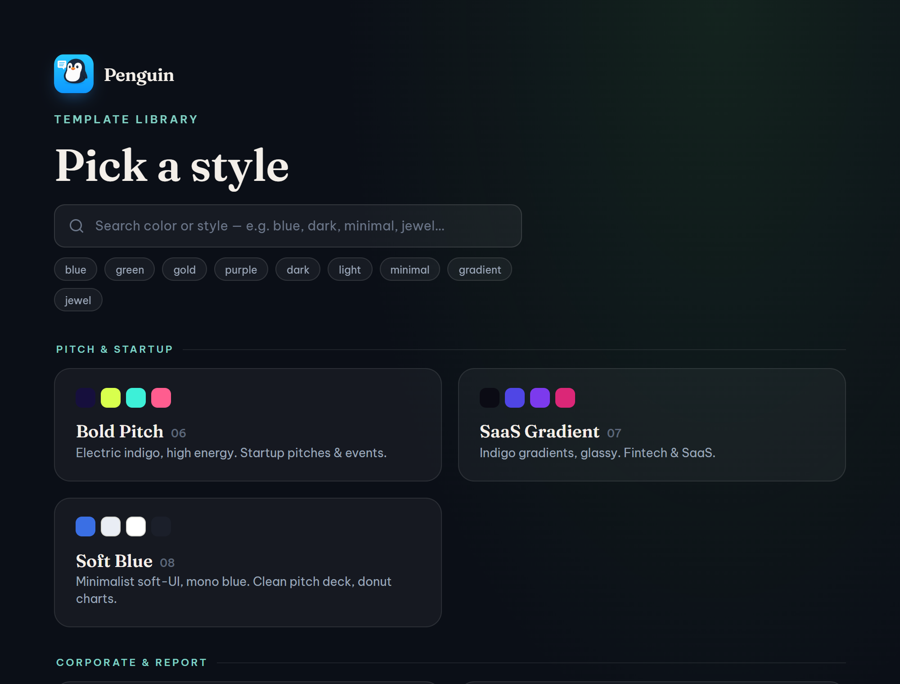
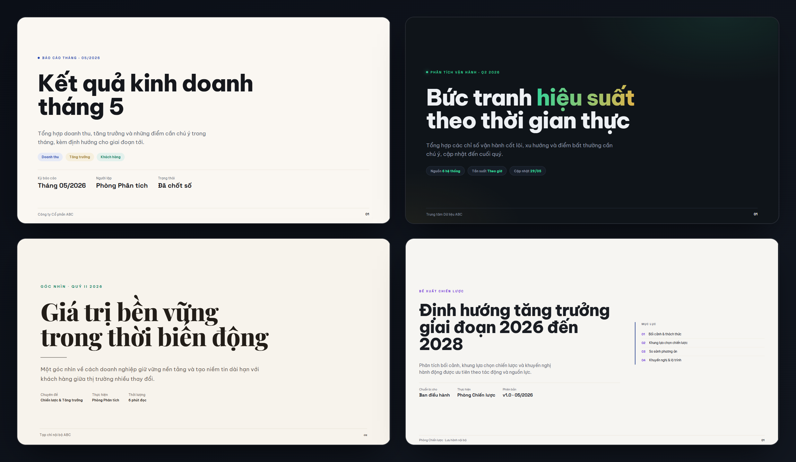
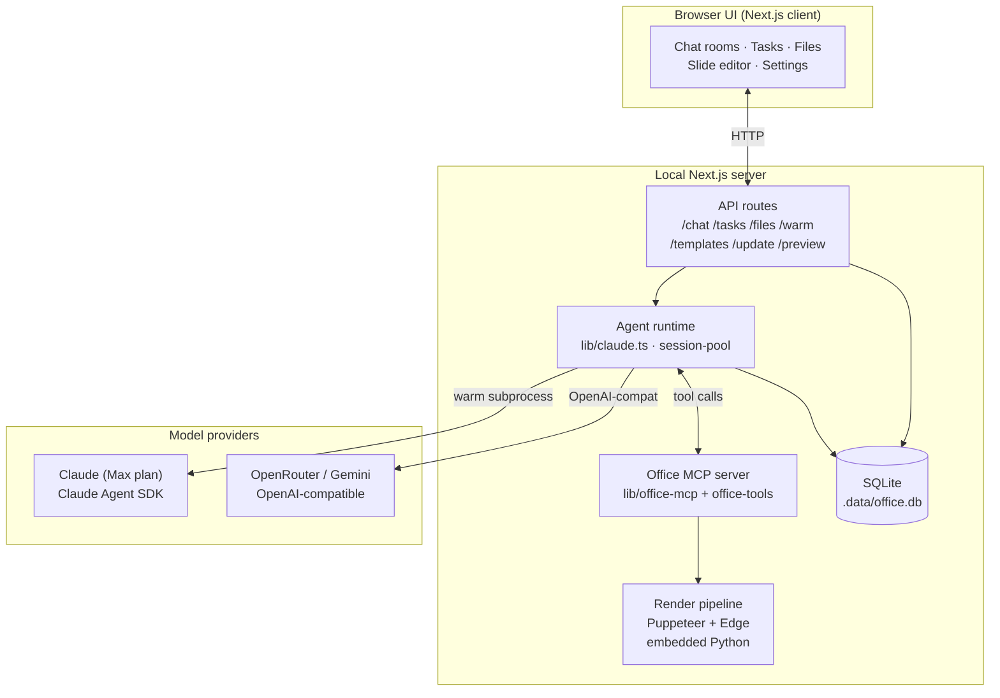
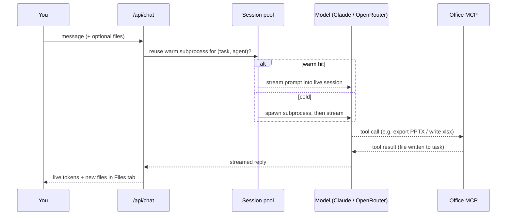

<div align="center">



# Penguin

### Your own AI office, running on your machine.

A local-first **multi-agent workspace**: assemble your own team of AI agents that plan, talk to each other, and ship finished deliverables — slide decks, dashboards, Word, Excel, PDF and PowerPoint.

<p>
<a href="https://github.com/dovannam115/penguin-releases/releases/latest"></a>


</p>

<br>



</div>

---

## Table of contents

- [What is Penguin?](#what-is-penguin)
- [Features](#features)
- [The slide template library](#the-slide-template-library)
- [System architecture](#system-architecture)
- [How one agent turn works](#how-one-agent-turn-works)
- [Project layout](#project-layout)
- [Office MCP tools](#office-mcp-tools)
- [Download & install](#download--install)
- [Requirements](#requirements)
- [Updating](#updating)
- [Privacy](#privacy)
- [Tech stack](#tech-stack)
- [License](#license)

---

## What is Penguin?

Penguin is a desktop AI workspace. Instead of chatting with a single model, you open a **task** and bring in a **team of agents** that you configure yourself. They split the work, hand off to one another, and produce **actual files** you can open and send — not just chat text.

Everything runs on your own machine. Chats, tasks and files live in a local folder and are never uploaded anywhere except, of course, to the AI provider you choose to power your agents.

## Features

### Your own team of agents

- **Fully configurable agents.** Every agent is a persona *you* define: name, role, system prompt, model, and which skills it can use. Penguin ships with a starter set so you can begin immediately, but you are meant to rename, retune, add or delete them to fit how you work.
- **Multi-agent rooms.** Add several agents to one task and they answer in parallel; address a specific one with `@Name`.
- **Manager / worker flow.** A coordinating agent can plan a task and delegate sub-work to others, then the results come back together.
- **Private 1-on-1 helpers.** An agent can be marked as a private assistant (e.g. a prompt-refining helper) that is never auto-pulled into group rooms.
- **Persistent, per-task memory.** Each task keeps its own conversation and context.

### Real deliverables, not just text

- **Documents:** export **Word (.docx)** and **PDF**; read back **.docx / .pdf / .xlsx / text** that you upload.
- **Spreadsheets:** write **Excel (.xlsx) with live formulas**, and read existing workbooks.
- **Presentations:** export **PowerPoint** two ways — pixel-perfect **image** slides, or **native, fully editable** slides with embedded fonts; inspect an existing `.pptx` to reuse its theme, colors and layouts; export **with a corporate brand background** baked under every slide.
- **Dashboards:** generate interactive **HTML dashboards** from data.
- **Files in, files out.** Drop files into a task for an agent to read; everything an agent produces lands in that task's **Files** tab.

### A beautiful slide template library

- **20 ready-made slide languages**, grouped by use (pitch, corporate & report, editorial, infographic / data / planning).
- Refined **jewel palettes** (emerald · sapphire · plum · gold) on warm-ivory or deep-dark backgrounds, light-first and Vietnamese-ready.
- **Live hover preview** — hover any card and the slides auto-play so you see the whole deck before opening it.
- **Search by color or style** ("blue", "đỏ", "dark", "minimal", "jewel"…), accent-insensitive and bilingual.
- Each template is **self-contained HTML** the agents reuse as a starting point and fill with your real content.

### Edit slides right in the app

- **Visual editor:** click an element to change its text, font size, color and box; drag to reposition.
- **AI editor:** draw a box over part of a slide and **describe the change in plain language** — the model rewrites just that fragment.

### Bring your own model

- Works with **Claude (Max plan)** out of the box via the Claude Agent SDK.
- Or plug an **OpenRouter / Gemini** API key for faster, cheaper agents.
- **Per-agent** model selection — mix providers across your team.

### Built for speed & privacy

- A **warm session pool** keeps the Claude runtime alive between turns, and **pre-warms** while you type, so replies start fast.
- **100% local data** with a password-protected login; nothing leaves your machine except your prompts to the provider.
- **Self-updating** from this repository's Releases.

## The slide template library

Twenty styles, from clean executive dashboards to dense consulting decks, warm editorial and dark analytics — all light-first friendly and Vietnamese-ready.

<div align="center">

</div>

---

## System architecture

Penguin is a single **Next.js** app that runs locally. The browser UI talks to Next.js API routes; those routes drive the agent runtime, a local **Office MCP** tool server, a local **SQLite** database, and a rendering pipeline (Edge via Puppeteer + an embedded Python runtime) for documents and slide previews.



**Key pieces**

- **Agent runtime (`lib/claude.ts`, `lib/session-pool.ts`).** Routes each agent to the right backend by model. Claude agents run through the Claude Agent SDK; a **warm session pool** keeps one CLI subprocess alive per `(task, agent)` so follow-up turns skip the ~5–9s cold start, with idle reaping and DB-backed session resume across restarts.
- **OpenAI-compatible backend (`lib/openai-compat.ts`).** Serves OpenRouter / Gemini agents through the same streaming contract.
- **Office MCP server (`lib/office-mcp.ts`, `lib/office-tools/`).** Exposes the file/export tools agents call to read and produce documents, spreadsheets, PDFs, dashboards and slides.
- **Render pipeline.** HTML is rendered with **Puppeteer driving Microsoft Edge**; an **embedded Python runtime** (`python-embed/`) powers native PPTX generation and template cloning. No system Python needed.
- **Storage (`lib/db.ts`).** A local **SQLite** database (`node:sqlite`) holds agents, tasks, messages, settings and session ids. Uploads and exports live alongside it under `.data/`.
- **Auth (`lib/auth.ts`, `lib/api-auth.ts`).** A local password gate; an auth token guards the API routes.
- **Updater (`app/api/update/*`).** Checks this repo's Releases, downloads, stages and applies a new build in place.

## How one agent turn works



## Project layout

```
penguin/
├─ app/                  Next.js App Router
│  ├─ api/               chat · tasks · files · warm · templates · update · preview · auth · settings · skills · employees
│  ├─ login/             local password gate
│  └─ page.tsx           main office UI
├─ components/           chat drawer, office canvas, file/slide editor, dialogs, dashboards
├─ lib/
│  ├─ claude.ts          agent runtime (Claude Agent SDK)
│  ├─ session-pool.ts    warm subprocess pool + pre-warm
│  ├─ openai-compat.ts   OpenRouter / Gemini backend
│  ├─ office-mcp.ts      Office MCP tool server
│  ├─ office-tools/      html→pptx (image + native), exporters
│  ├─ ai-edit.ts         "AI edit" slide fragment rewriter
│  ├─ db.ts              SQLite (agents, tasks, messages, settings)
│  ├─ models.ts          provider routing (claude / openrouter / gemini)
│  ├─ memory.ts          per-agent memory injection
│  └─ seed.ts            starter agent personas
├─ templates/            20 slide templates + searchable gallery (index.html)
├─ python-embed/         embedded Python runtime for native PPTX
├─ public/               icons, fonts, manifest
└─ scripts / *.bat / *.ps1   launcher, packer, updater
```

## Office MCP tools

The tools agents use to read and produce files:

| Tool | What it does |
|------|--------------|
| `write_text` / `edit_text` / `read_text` | Create, patch and read text / Markdown / HTML |
| `export_docx` / `read_docx` | Write and read Word documents |
| `xlsx_write` / `read_xlsx` | Write Excel **with live formulas**, read workbooks |
| `export_pdf` / `read_pdf` | Generate and read PDFs |
| `export_dashboard` | Build an interactive HTML dashboard |
| `slide_template` | List / fetch a slide template as a quality starting point |
| `pptx_inspect_template` | Read a `.pptx` theme, palette, fonts and layouts to match a brand |
| `pptx_export` | Export a deck to PowerPoint — image-perfect or native editable |

---

## Download & install

1. Grab the latest **`Penguin_v*.zip`** from the [**Releases**](https://github.com/dovannam115/penguin-releases/releases/latest) page.
2. Unzip anywhere, then double-click **`start.bat`**. The first run installs dependencies (with a progress bar); later runs start instantly.
3. Open **http://localhost:3000**, then go to **⚙ Settings** to set your name and, optionally, paste an OpenRouter API key.
4. Click **+ New chat**, add one or more agents, and give them a task. Address a specific agent with `@Name`. Anything they produce appears in the task's **Files** tab.

## Requirements

- **Windows** with **Node.js 22+** ([nodejs.org](https://nodejs.org), LTS).
- **Microsoft Edge** (used for slide/PPTX rendering — preinstalled on Windows).
- To use **Claude** agents: be signed in to **Claude Code (Max plan)** once on the machine.
- To use **OpenRouter / Gemini** agents: an [OpenRouter API key](https://openrouter.ai/keys), pasted into Settings.
- Any one model source is enough to get going.

## Updating

Penguin updates itself. In the app: **Settings → Update → Check now**, or drop a downloaded zip into **Settings → Update → Install from a local zip**, then **Restart Penguin**.

## Privacy

All chats, tasks and files are stored locally in a `.data/` folder and protected behind a local password. Penguin uploads nothing on its own — the only data that leaves your machine is the prompt content you send to whichever model provider powers each agent.

## Tech stack

Next.js 16 · TypeScript · Tailwind 4 · `@anthropic-ai/claude-agent-sdk` · OpenAI-compatible providers (OpenRouter / Gemini) · local SQLite (`node:sqlite`) · Puppeteer (Microsoft Edge) · embedded Python for native PPTX.

## License

Released under the [MIT License](LICENSE).

<div align="center">
<br>
<sub>Made with 🐧 for people who'd rather delegate than copy-paste.</sub>
</div>
